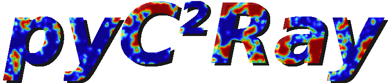

.. _pyc2ray:

pyC2Ray: A Flexible and GPU-Accelerated Radiative Transfer Framework for EoR
============================================================================

The **pyC2Ray** code is an updated version of the massively parallel ray-tracing and chemistry code, *C2Ray*, which has been extensively used in reionization simulations and often requires millions of CPU-core hours on several thousand computing nodes in high-performance computing (HPC) environments.

The most time-consuming part of the code is calculating the hydrogen column density along the path of ionizing photons. With the **pyC2Ray** update, we introduce the *Accelerated Short-characteristics Octahedral RAytracing (ASORA)* method, a ray-tracing algorithm specifically designed to run on GPUs.  

The algorithm is written in *C++/CUDA* and wrapped in a *Python* interface, allowing for easy and customized use of the code without compromising computational efficiency.

Reporting Issues and Contributing
=================================

If you encounter any bugs or unexpected behavior in the code, please feel free to open a GitHub `issue`_. The issue page is also the best place to ask for help or provide suggestions.

.. _issue: https://github.com/cosmic-reionization/pyC2Ray/issues

Acknowledgements
================

The updated version of the original code was initially developed by Patrick Hirling (see his `GitHub`_) as part of an astrophysics practical workshop for master’s students supervised by Michele Bianco at EPFL.  

If you use this code in one of your scientific publications, please acknowledge it by citing the associated paper_.

.. _paper: https://arxiv.org/abs/2311.01492
.. _GitHub: https://github.com/phirling

Indices and Tables
==================

* :ref:`genindex`
* :ref:`modindex`
* :ref:`search`

.. toctree::
   :hidden:
   :maxdepth: 2

   installation
   tutorials
   examples
   modules
   contributors
